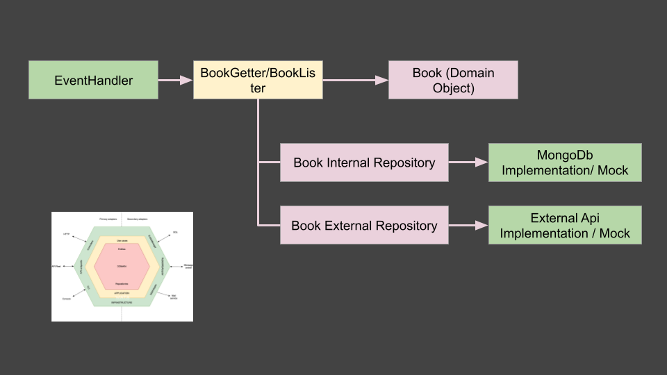
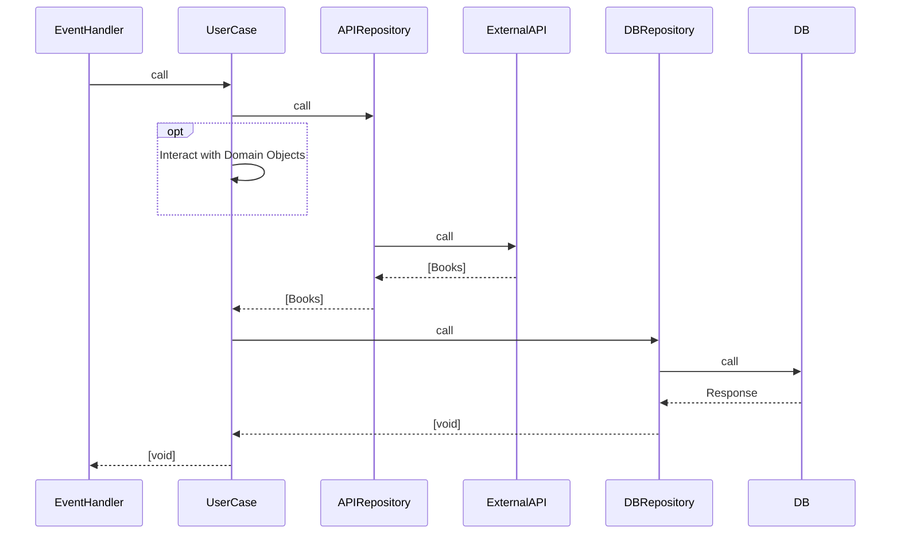

# Technical Assessment - Typescript

## Description:

The project handles incoming events by making corresponding API calls and persisting the data in a MongoDB. While errors are effectively managed, there is currently no implemented business logic for these scenarios. Instead, an error log trace is generated, and no information is stored.

Test cases were written. This includes unit tests for individual components, testing of specific use cases, and integration tests that involve interfacing with both MongoDB and a MockServer.

## Architecture Overview



The architecture revolves around the handling of input events by the `EventHandler` class. This class, in turn, invokes the appropriate use cases based on the action specified by the event.

The primary logic for each use case is encapsulated within the BookGetter and BookLister classes. These classes serve as orchestrators for the business logic associated with their respective use cases.

Each use case is implemented using Domain Classes and interfaces. The Book class represents the core entity and is utilized in both internal and external repositories.

The BookInternalRepository (`BookInternalRepository`) is an interface acting as a port. An adapter is employed to access either a MongoDB database or a Mock implementation for unit testing purposes.

Similarly, the BookExternalRepository (`BookExternalRepository`) serves as an interface acting as a port for connecting to an external API to retrieve books. A Mock implementation is available for unit testing scenarios



## Testing project in local

- For unit tests:

```
npm run test:unit

```

- For integration tests

```
npm run test:integration
```

> [!Note]
> To run integration test a MongoDB server is needed. A Docker Compose file is provided to create a Docker container with these dependency. To start the service, run:

```
docker-compose up -d
```

It is possible to launch all test together with

```
npm run test

```
